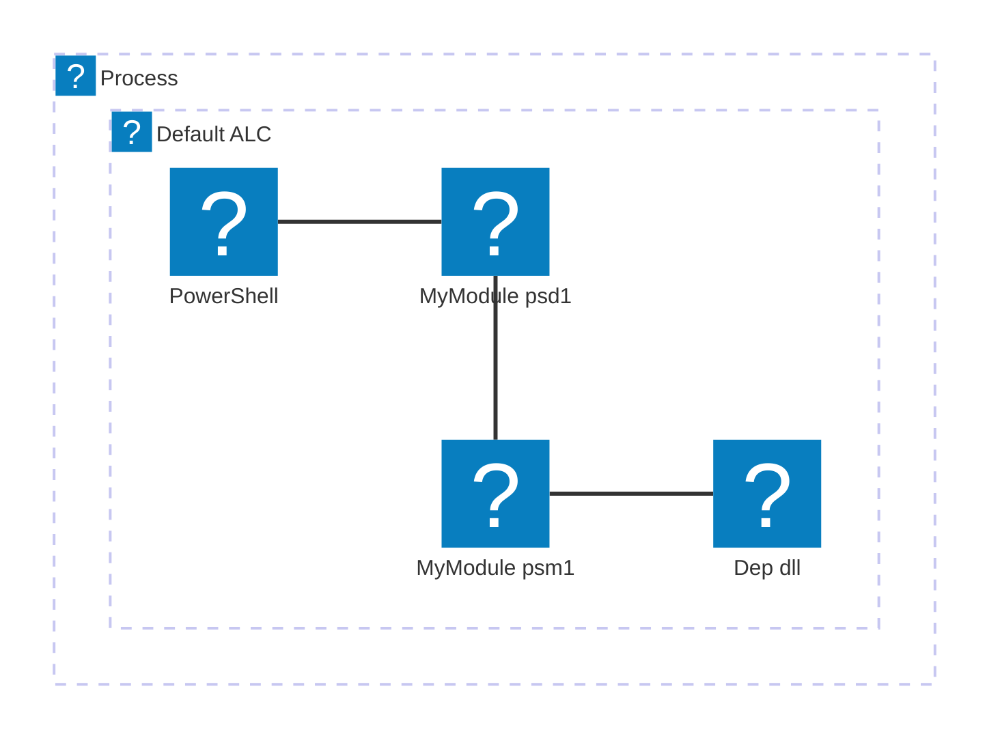
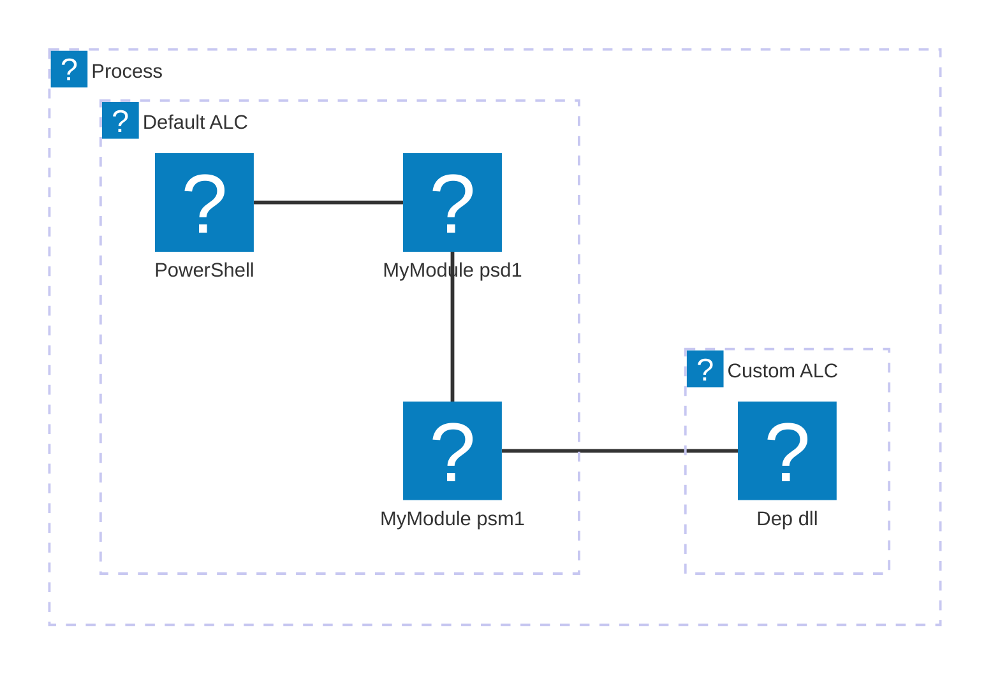
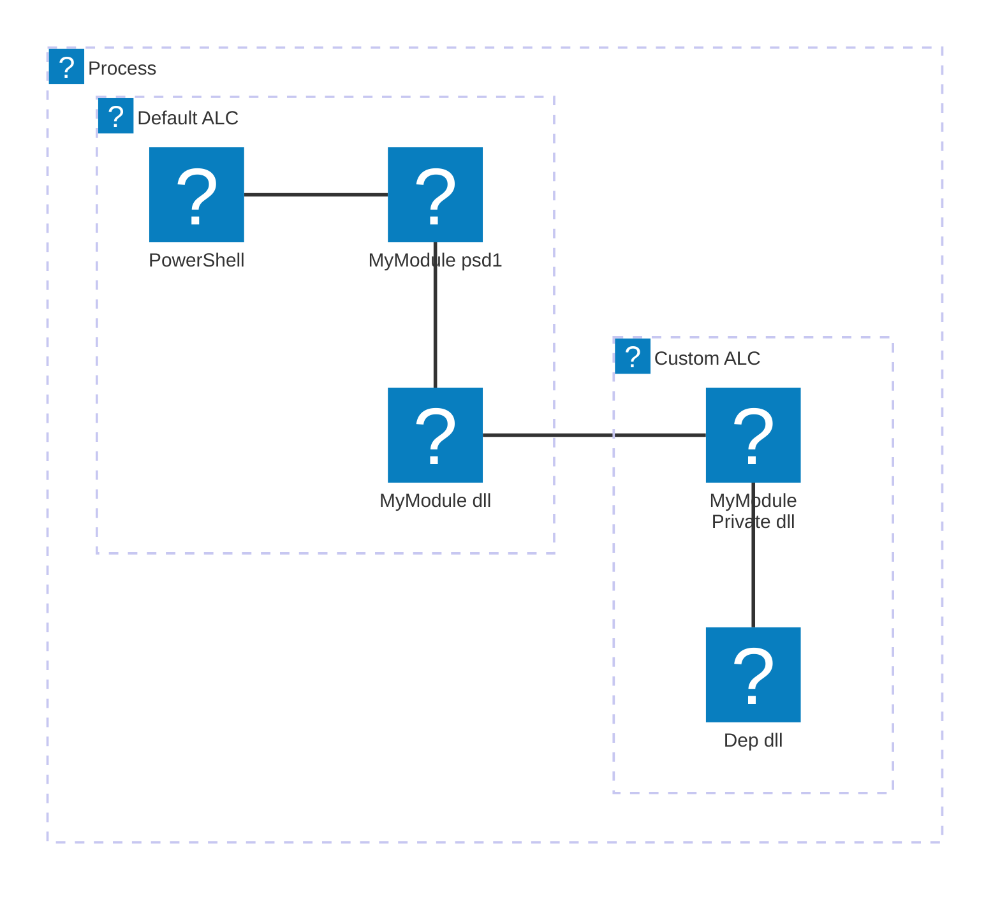
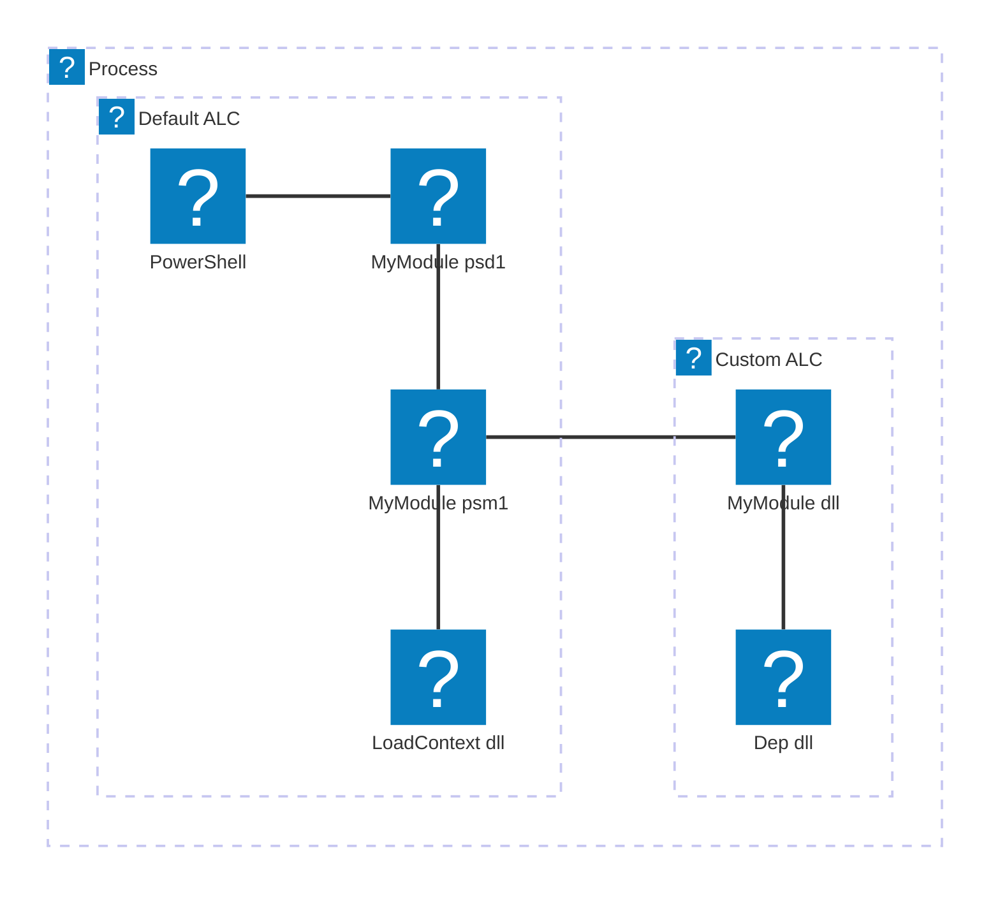

# Assembly Resolver

```mermaid
architecture-beta
    group process(logos:mdi:powershell)[Process]
    group default(logos:dotnet)[Default ALC] in process

    service script(logos:mdi:code-greater-than)[PowerShell] in default
    service module_psd1(logos:mdi:file-document)[MyModule psd1] in default
    service module_psm1(logos:mdi:file-code)[MyModule psm1] in default
    service dep_asm(logos:mdi:file-code)[Dep dll] in default

    script:R -- L:module_psd1
    module_psd1:B -- T:module_psm1
    module_psm1:R -- L:dep_asm
```

# Script ALC

```mermaid
architecture-beta
    group process(logos:mdi:powershell)[Process]
    group default(logos:dotnet)[Default ALC] in process
    group alc(logos:dotnet)[Custom ALC] in process

    service script(logos:mdi:code-greater-than)[PowerShell] in default
    service module_psd1(logos:mdi:file-document)[MyModule psd1] in default
    service module_psm1(logos:mdi:file-code)[MyModule psm1] in default
    service dep_asm(logos:mdi:file-code)[Dep dll] in alc

    script:R -- L:module_psd1
    module_psd1:B -- T:module_psm1
    module_psm1:R -- L:dep_asm
```

# ALC Resolver

```mermaid
architecture-beta
    group process(logos:mdi:powershell)[Process]
    group default(logos:dotnet)[Default ALC] in process
    group alc(logos:dotnet)[Custom ALC] in process

    service script(logos:mdi:code-greater-than)[PowerShell] in default
    service module_psd1(logos:mdi:file-document)[MyModule psd1] in default
    service module_asm(logos:mdi:file-code)[MyModule dll] in default
    service module_private_asm(logos:mdi:file-code)[MyModule Private dll] in alc
    service dep_asm(logos:mdi:file-code)[Dep dll] in alc

    script:R -- L:module_psd1
    module_psd1:B -- T:module_asm
    module_asm:R -- L:module_private_asm
    module_private_asm:B -- T:dep_asm
```

# ALC Loader

```mermaid
architecture-beta
    group process(logos:mdi:powershell)[Process]
    group default(logos:dotnet)[Default ALC] in process
    group alc(logos:dotnet)[Custom ALC] in process

    service script(logos:mdi:code-greater-than)[PowerShell] in default
    service module_psd1(logos:mdi:file-document)[MyModule psd1] in default
    service module_psm1(logos:mdi:code-braces-box)[MyModule psm1] in default
    service load_context(logos:mdi:file-code)[LoadContext dll] in default
    service module_asm(logos:mdi:file-code)[MyModule dll] in alc
    service dep_asm(logos:mdi:file-code)[Dep dll] in alc

    script:R -- L:module_psd1
    module_psd1:B -- T:module_psm1
    module_psm1:R -- L:module_asm
    module_psm1:B -- T:load_context
    module_asm:B -- T:dep_asm
```
